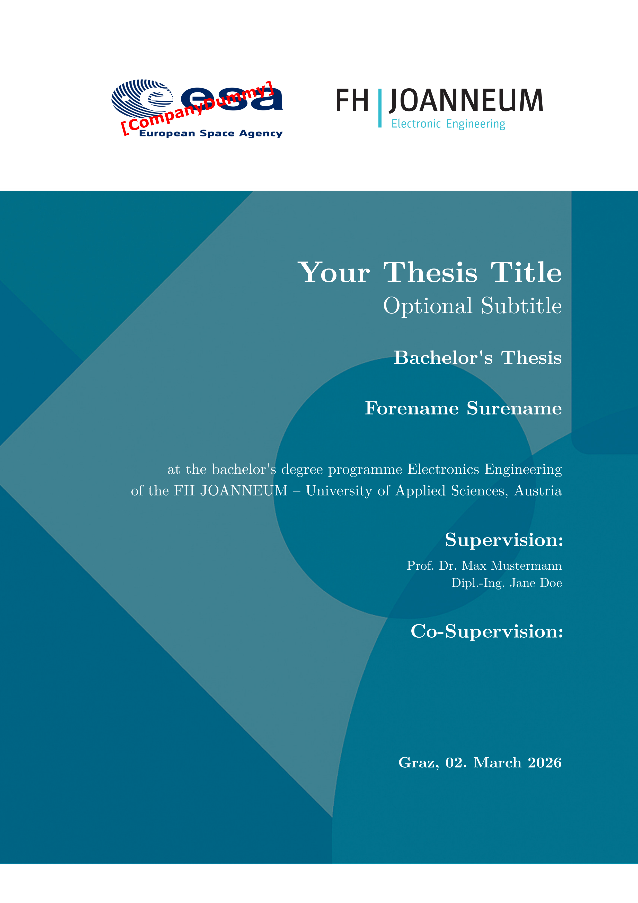

> [!WARNING]
> This is still WIP, feel free to open issues or PRs!
> This is not a real typst template yet.

# typst-ECE-template
This Typst template is intended for writing a bachelors thesis at the Electronic Engineering departement at FH JOANNEUM. Lab reports and master thesis options might be added later.

## Getting Started
- Clone this repository: `git clone https://github.com/leotfh/typst-ECE-template`
- If you want to have a more clean template without the visual aids in the header: checkout the `salloker` branch
- Install VSCode
- Install the [TinyMist](https://marketplace.visualstudio.com/items?itemName=myriad-dreamin.tinymist) extension for VSCode (provides preview, PDF rendering and linting capabilities)
- Edit `main.typ` to fit your needs
- Kind of optional, but installing the "Latin Modern Roman" font is recommended to get the original look of the IEE LaTeX template. You can download it [here](https://www.gust.org.pl/projects/e-foundry/latin-modern/download)

Now you should be able to preview the document.

## References
- Florian Mayer's LaTeX template: https://github.com/Electronic-and-Computer-Engineering/IEETemplate
- Another Typst template used at the IIT Institute: https://git-iit.fh-joanneum.at/oss/thesis-template/-/blob/main/template/thesis.typ?ref_type=heads
